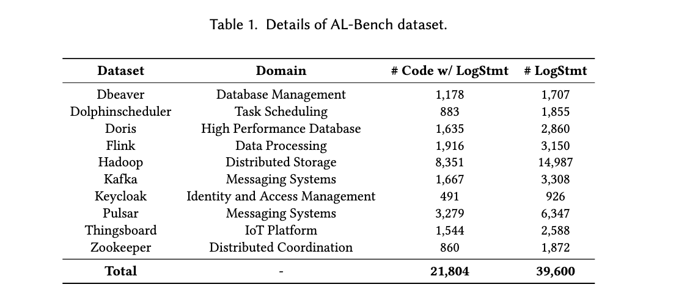
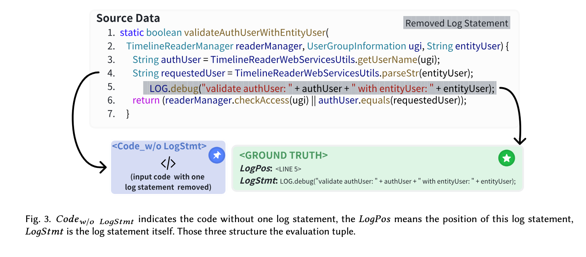
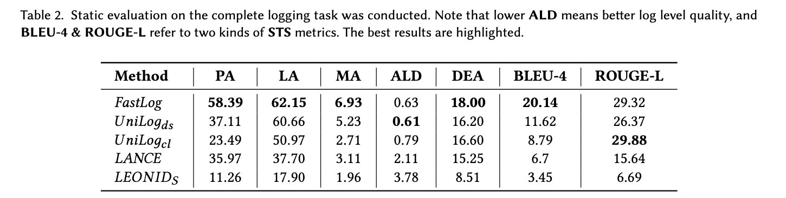
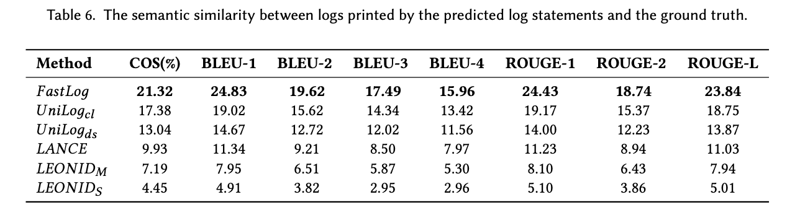

# AL-Bench: Automatic Logging Benchmark

[English](README.md) | [中文](README_CN.md)
## Overview

AL-Bench includes a high-quality dataset and a novel dynamic evaluation method focused on runtime logs, addressing key limitations of prior studies and bridging the gap between real-world requirements and existing evaluation frameworks.

## Project Structure

```
.
├── Static_Evaluation/    # Scripts and results for static evaluation
│   ├── eval/            # Evaluation scripts for each logging tool
│   └── data/            # Evaluation result data
└── Dynamic_Evaluation/  # Scripts and results for dynamic evaluation
    ├── dynamic_evaluation/  # Core scripts for dynamic evaluation
    └── init_dynamic_evaluation/  # Dataset construction scripts
```

## Dataset


The complete evaluation dataset can be accessed at: https://drive.google.com/drive/u/1/folders/1eoK7SaYTuwqcAe9T3ddjeU5oGLRDX2Ps

## Evaluation Methods

### Static Evaluation

Static evaluation focuses on the following aspects:
1. Log Level Accuracy (LA)
2. Log Position Accuracy (PA)
3. Log Message Accuracy (MA)
4. Average Level Distance (ALD)
5. Dynamic Expression Accuracy (DEA)
6. Static Text BLEU ROUGE Score (STS)



*Figure 2: Static evaluation process and metrics calculation*

### Dynamic Evaluation

Dynamic evaluation assesses the performance of logging tools in actual runtime environments:
1. Compilation Success Rate
2. Log Similarity


*Figure 3: Dynamic evaluation process*

## Evaluation Results

### Static Evaluation



### Dynamic Evaluation



## Quick Start

### Requirements
- Java Development Kit (JDK)
- Maven
- Node.js
- Docker (for dynamic evaluation)

### Static Evaluation

1. Enter the Static_Evaluation directory:
```bash
cd Static_Evaluation
```

2. Run evaluation script:
```bash
python eval/[tool_name]/run_eval.py
```

### Dynamic Evaluation
Strongly recommend using Docker to run the dynamic evaluation.

1. Pull the Docker image:
```bash
docker pull boyintan/al-bench:hadoop-build
```

2. Run the Docker container:
```bash
docker run -it -v $(pwd):/home/al-bench boyintan/al-bench:hadoop-build /bin/bash
```

3. Run the evaluation script:
```bash
cd Dynamic_Evaluation
```

4. Run the evaluation script:
```bash
python Dynamic_Evaluation/get_logs_output/execute_unittest.py --execute_id [execute_id] --results_dir [results_dir] --json_path [json_path] --use_catch_point [use_catch_point] --record_error [record_error] --num_thread [num_thread]
```

Prepare the data for dynamic evaluation, the data should be in the following format:
```json
[{
    "uuid": "uuid",
    "prediction": "prediction",
    "predicted_log_statement": {
        "log_statement": "log_statement",
        "log_position": "log_position"
    }
}]
```
`
"prediction" should be the standard code format with '/n' as the line break.
"predicted_log_statement" should be the log statement in the code.
"log_position" should be the line number of the log statement in the code.
`


## Dataset

The complete evaluation dataset can be accessed at:
https://drive.google.com/drive/u/1/folders/1eoK7SaYTuwqcAe9T3ddjeU5oGLRDX2Ps

## Evaluated Logging Tools

- FastLog
- UniLog
- LANCE
- LEONID

## Citation

If you use AL-Bench in your research, please cite our paper: 
```markdown
    @misc{tan2025albenchbenchmarkautomaticlogging,
        title={AL-Bench: A Benchmark for Automatic Logging}, 
        author={Boyin Tan and Junjielong Xu and Zhouruixing Zhu and Pinjia He},
        year={2025},
        eprint={2502.03160},
        archivePrefix={arXiv},
        primaryClass={cs.SE},
        url={https://arxiv.org/abs/2502.03160}, 
    }
```

## License

This project is licensed under the MIT License - see the [LICENSE](LICENSE) file for details.
