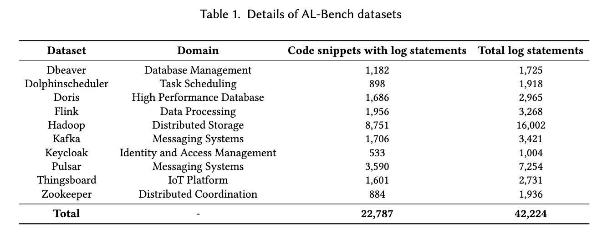
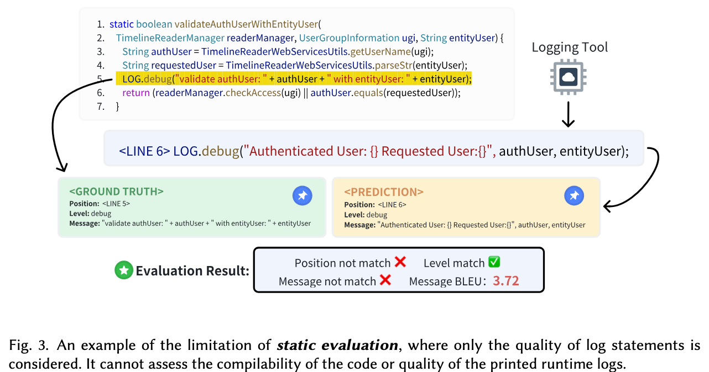
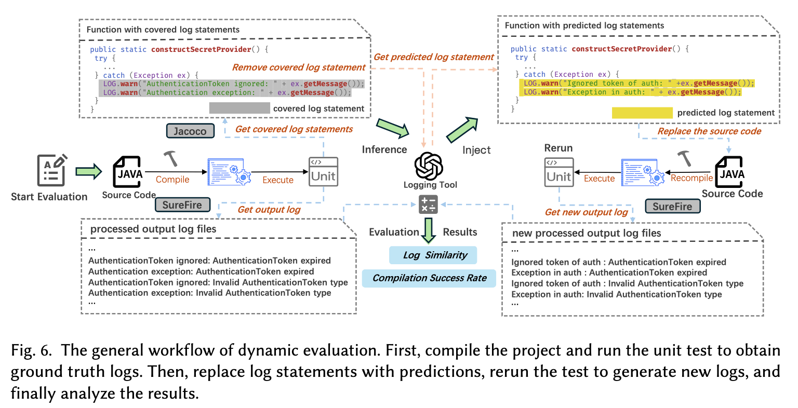
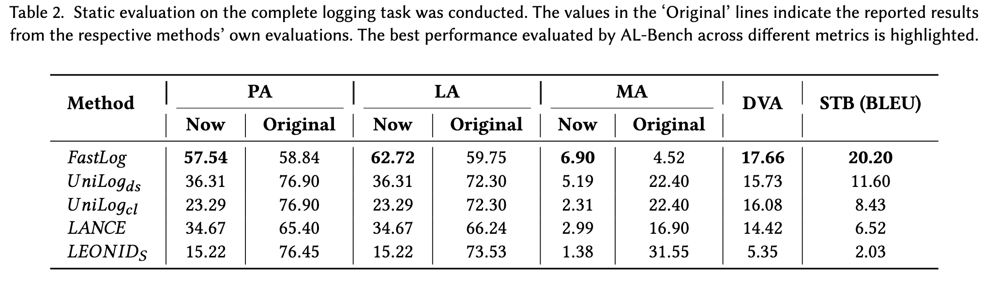
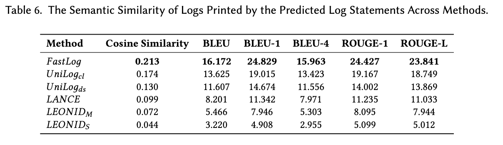

# AL-Bench: 自动日志基准测试框架

[English](README.md) | [中文](README_CN.md)

## 概述

AL-Bench 提供高质量的数据集和创新的动态评估方法，专注于运行时日志，解决了先前研究的关键局限性，并弥合了实际需求与现有评估框架之间的差距。

## 项目结构

```
.
├── Static_Evaluation/    # 静态评估相关脚本和结果
│   ├── eval/            # 各个日志工具的评估脚本
│   └── data/            # 评估结果数据
└── Dynamic_Evaluation/  # 动态评估相关脚本和结果
    ├── dynamic_evaluation/  # 动态评估核心脚本
    └── init_dynamic_evaluation/  # 数据集构建脚本
```

## 数据集


完整的评估数据集可在以下位置获取：
https://drive.google.com/drive/u/1/folders/1eoK7SaYTuwqcAe9T3ddjeU5oGLRDX2Ps

## 评估方法

### 静态评估

静态评估主要关注以下几个方面：
1. 日志级别准确性 (LA)
2. 日志位置准确性 (PA)
3. 日志消息准确性 (MA)
4. 动态变量准确性 (DVA)
5. 静态文本 BLEU 分数 (STB)



*图 2: 静态评估流程和指标计算*

### 动态评估

动态评估基于 Hadoop 3.4.0 的单元测试，评估日志工具在实际运行环境中的表现：
1. 编译成功率
2. 日志相似度



*图 3: 基于 Hadoop 测试套件的动态评估结果*

## 评估结果

### 静态评估


### 动态评估


## 快速开始

### 环境要求
- Java Development Kit (JDK)
- Maven
- Node.js
- Docker (用于动态评估)

### 静态评估

1. 进入 Static_Evaluation 目录：
```bash
cd Static_Evaluation
```

2. 运行评估脚本：
```bash
python eval/[tool_name]/run_eval.py
```

### 动态评估

1. 准备环境：
```bash
cd Dynamic_Evaluation
# 按照 init_dynamic_evaluation 中的说明构建 Docker 环境
```

2. 运行演示评估：
```bash
# 修改 dynamic_evaluation.js 中的路径配置
# 运行评估脚本
./start-test.sh
```

## 数据集

完整的评估数据集可在以下位置获取：
https://drive.google.com/drive/u/1/folders/1eoK7SaYTuwqcAe9T3ddjeU5oGLRDX2Ps

## 评估的日志工具

- FastLog
- UniLog
- LANCE
- LEONID

## 引用

如果您在研究中使用了 AL-Bench，请引用我们的论文：
```markdown
    @misc{tan2025albenchbenchmarkautomaticlogging,
        title={AL-Bench: A Benchmark for Automatic Logging}, 
        author={Boyin Tan and Junjielong Xu and Zhouruixing Zhu and Pinjia He},
        year={2025},
        eprint={2502.03160},
        archivePrefix={arXiv},
        primaryClass={cs.SE},
        url={https://arxiv.org/abs/2502.03160}, 
    }
```

## 许可证

本项目采用 MIT 许可证 - 查看 [LICENSE](LICENSE) 文件了解详情。